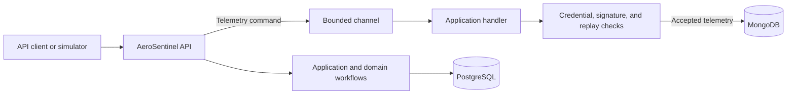

# AeroSentinel

AeroSentinel is an aviation telemetry API and simulator suite. The API accepts aircraft telemetry, checks its HMAC-SHA256 signature and replay sequence, and stores accepted frames. It also exposes endpoints for aircraft credentials, flight plans, route waypoints, and waypoint lookup. Domain validation includes aviation identifiers and geographic values used by the project.

This repository contains the .NET solution in `AeroSentinel/` and Python telemetry simulators in `Simulator/`.

## Capabilities

- Verify telemetry signatures with per-aircraft credentials.
- Reject invalid signatures and validate sequence progression for replay protection.
- Process telemetry through a bounded asynchronous channel before persistence.
- Store flight plans, routes, aircraft profiles, credentials, and waypoints in PostgreSQL; store telemetry frames in MongoDB.
- Generate signed telemetry for local development and intentionally invalid signatures for security testing.

## Architecture



The solution is organized into four projects:

| Project | Responsibility |
| --- | --- |
| `AeroSentinel.Api` | HTTP endpoints, OpenAPI, and application startup |
| `AeroSentinel.Application` | Commands, handlers, and application services |
| `AeroSentinel.Domain` | Domain aggregates, value objects, and validation |
| `AeroSentinel.Infrastructure` | PostgreSQL and MongoDB persistence, cryptography, and background processing |

## Prerequisites

- .NET 10 SDK
- PostgreSQL
- MongoDB
- Python 3.9 or later and `pip` (only needed for the simulators)

## Run Locally

Run these commands from the repository root. The API uses `http://localhost:5253` for the `http` launch profile.

First provide database settings. For PowerShell, replace the placeholders with local development values:

```powershell
$env:ConnectionStrings__Postgres = "Host=localhost;Port=5432;Database=aerosentinel;Username=<username>;Password=<password>"
$env:Mongo__ConnectionString = "mongodb://localhost:27017"
$env:Mongo__Database = "aerosentinel"
```

The API requires all three settings during startup. The checked-in appsettings files do not include database connection details. Keep real credentials out of source control.

Build and run:

```powershell
dotnet build AeroSentinel/AeroSentinel.slnx
dotnet run --project AeroSentinel/src/AeroSentinel.Api/AeroSentinel.Api.csproj --launch-profile http
```

Swagger UI is available at [http://localhost:5253/swagger](http://localhost:5253/swagger). The HTTPS launch profile also serves `https://localhost:7154` and `http://localhost:5253`.

## Database Setup

EF Core migrations are included in `AeroSentinel.Infrastructure`, but the API does not apply them automatically. Install the .NET EF CLI (`dotnet-ef`) with a version compatible with the EF Core packages, then run this from the repository root after setting the database environment variables above:

```powershell
dotnet ef database update `
  --project AeroSentinel/src/AeroSentinel.Infrastructure/AeroSentinel.Infrastructure.csproj `
  --startup-project AeroSentinel/src/AeroSentinel.Api/AeroSentinel.Api.csproj `
  --context ApplicationDbContext
```

The PostgreSQL server must be reachable for the migration to run. Waypoint CSV import code is present, but the startup call is currently disabled; a new database will not be populated with waypoints automatically.

## API Overview

| Method | Route | Description |
| --- | --- | --- |
| `POST` | `/credentials` | Create a credential for an aircraft identifier |
| `GET` | `/credentials` | List credentials |
| `POST` | `/flight-plans` | Create a flight plan |
| `POST` | `/flight-plans/{flightPlanId}/routes` | Add a waypoint to a flight-plan route |
| `GET` | `/waypoints` | List waypoints |
| `GET` | `/waypoints/{waypointId}` | Get a waypoint by identifier |
| `POST` | `/telemetry` | Queue a telemetry frame for asynchronous processing |
| `GET` | `/telemetry` | List telemetry frames |
| `GET` | `/telemetry/{messageId}` | Get a telemetry frame by message ID |

`POST /telemetry` returns `202 Accepted` when the frame is queued. Signature and replay checks run in the background, so acceptance means queued for processing, not that the telemetry has passed validation. Requests and sample payloads are in [`AeroSentinel.Api.http`](AeroSentinel/src/AeroSentinel.Api/AeroSentinel.Api.http).

## Simulators

Install the simulator dependency from the repository root:

```powershell
py -m pip install -r Simulator/requirements.txt
```

The legitimate simulator requires an existing aircraft credential and flight plan. Set the API URL, aircraft ICAO24, callsign, corresponding 32-byte HMAC key as 64 hexadecimal characters, flight-plan UUID, and send interval:

```powershell
$env:SIMULATOR_API_BASE_URL = "http://localhost:5253"
$env:SIMULATOR_ICAO24 = "758802"
$env:SIMULATOR_CALLSIGN = "CEB123"
$env:SIMULATOR_SECRET_HEX = "<64-character-hex-key>"
$env:SIMULATOR_FLIGHT_PLAN_ID = "<flight-plan-uuid>"
$env:SIMULATOR_INTERVAL_SECONDS = "1.0"
py Simulator/legitimate_simulator.py
```

Other simulator scripts:

- [`legitimate_simulator2.py`](Simulator/legitimate_simulator2.py) sends a second legitimate stream and uses the equivalent `SIMULATOR2_*` environment variables.
- [`malicious_simulator.py`](Simulator/malicious_simulator.py) deliberately sends an invalid signature. Use it only against a local or otherwise authorized test instance.

Never commit simulator HMAC keys or use real aircraft credentials in local examples.

## Security and Operational Notes

- Protect the API and its database connections; this repository does not include an authentication layer for the HTTP endpoints.
- **The current `GET /credentials` implementation includes `VerificationKey` in its response. Do not expose this endpoint to untrusted clients or networks. Redact the key and add appropriate access controls before deployment.**
- .NET Data Protection keys are persisted to the API process's relative `./keys` directory. Keep this directory writable and protect/persist it appropriately for the environment; do not commit production keys.
- Database migrations and waypoint import are manual; there is no checked-in container/deployment configuration.
- No automated test project or license file is currently included in the repository.

## Repository Layout

```text
AeroSentinel/
  AeroSentinel.slnx
  src/
    AeroSentinel.Api/
    AeroSentinel.Application/
    AeroSentinel.Domain/
    AeroSentinel.Infrastructure/
Simulator/
  common/
```